# 📄 Kibana - Local File Inclusion (LFI)

[Kibana](https://www.elastic.co/kibana/) es una herramienta de visualización de datos utilizada para explorar y analizar logs almacenados en Elasticsearch. Es comúnmente usada en entornos de monitoreo, seguridad y análisis de grandes volúmenes de datos.

## 🐞 Descripción de la vulnerabilidad

Esta máquina explota una vulnerabilidad de **Local File Inclusion (LFI)** en Kibana, que permite a un atacante leer archivos locales del sistema donde se ejecuta el servicio.

Una LFI ocurre cuando una aplicación web permite incluir archivos del sistema local sin una validación adecuada. En este caso, mediante una petición especialmente construida, se pueden leer archivos como `/etc/passwd`, `.bash_history`, o archivos sensibles de configuración.

> 💥 Este tipo de vulnerabilidad puede ser aprovechado para obtener credenciales, secretos o incluso escalar privilegios si se combina con otros vectores de ataque.

## ✅ Objetivo

Explotar la vulnerabilidad LFI en Kibana para acceder a archivos sensibles y demostrar su impacto en un entorno controlado.

---

## El primer paso es irnos a vulhub:

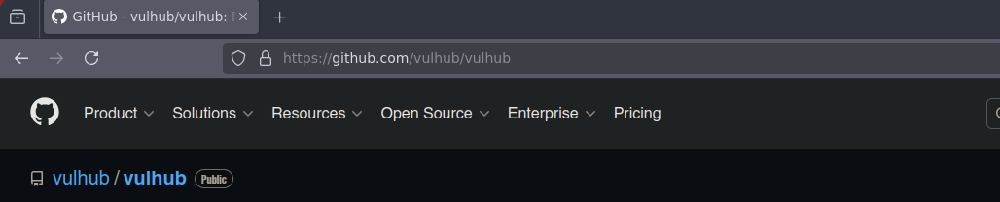
---

Luego, filtramos con **ctrl + f** y buscamos la máquina vulnerable **kibana**

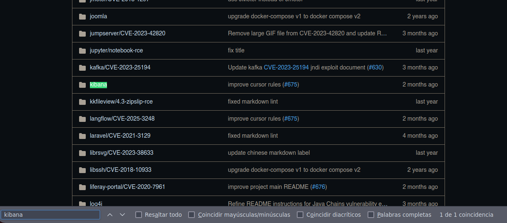

---
## Clonar la máquina en nuestro equipo

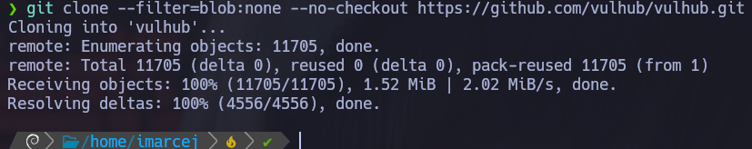

---

Desglose del comando
**git clone**:

Clona un repositorio remoto en tu máquina local.

--filter=blob:none
Esta opción dice:

No descargues ningún contenido de archivo (blob) al clonar; solo descarga la estructura del repositorio (commits, árboles, etc.).

Es parte de lo que se llama un "partial clone". El objetivo es reducir el tamaño del clon inicial. Luego, los blobs (contenido real de los archivos) se descargan solo cuando son necesarios.

👉 Esto es útil si el repo tiene muchos archivos pesados o históricos que no necesitas de inmediato.

--no-checkout
Esto evita que Git haga el "checkout" (es decir, que cree una copia de trabajo con los archivos en el disco).
Solo se clona el contenido del repositorio .git, sin extraer nada al sistema de archivos.

---

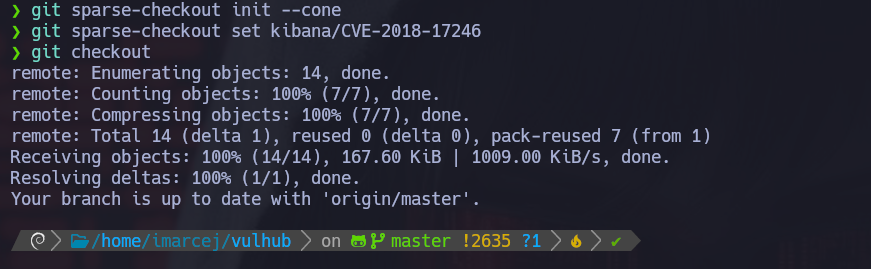

Esto se usa en combinación con un clone parcial para decirle a Git que solo quieres ciertos archivos o carpetas, no todo el repositorio. Es ideal para repos grandes o si solo necesitas una parte específica.

🔍 ¿Qué significa cada línea?
1. git sparse-checkout init --cone
🔹 Inicializa el modo de sparse checkout, que es una forma de decirle a Git:

"Quiero trabajar solo con una parte del árbol del repositorio."

--cone activa un modo simplificado y eficiente que solo permite incluir rutas completas (como carpetas o archivos directamente), sin patrones avanzados. Es el modo recomendado.

👉 En resumen: Preparo Git para trabajar solo con una parte del repo.

2. git sparse-checkout set ruta/al/archivo.txt
🔹 Indica qué archivos o carpetas quieres que Git descargue y te muestre en el sistema de archivos.

Aquí, ruta/al/archivo.txt es la ruta relativa del archivo que me interesa dentro del repo.

👉 Git no descargará ni mostrará nada más. Solo ese archivo (o carpeta si fuera una ruta de directorio).

3. git checkout
🔹 Esto hace el checkout aplicando las reglas del sparse checkout que acabo de configurar.

Como antes usé --no-checkout, hasta ahora no había extraído nada.

Este paso descarga y muestra en tu disco solo el archivo que descargué, no todo el repositorio.

---

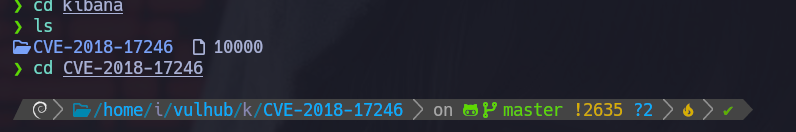

---

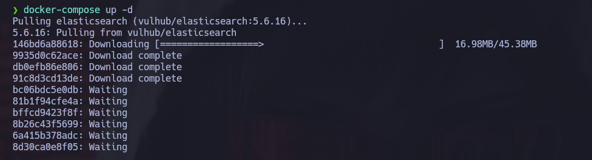

---

Ahora ejecutamos **docker-compose**: 

Es una herramienta indispensable en hacking porque permite construir laboratorios dinámicos, reproducibles y controlados con facilidad. Esto mejora la eficiencia en pruebas y aumenta tu capacidad para simular situaciones del mundo real.

---

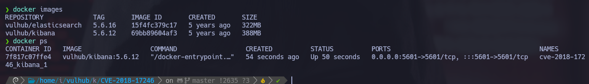

---

Ahora que ya tenemos el laboratorio desplegado, vemos que en el contenedor tenemos el puerto **5601** la aplicación de kibana, el siguiente paso es ir a nuestro **localhost**:

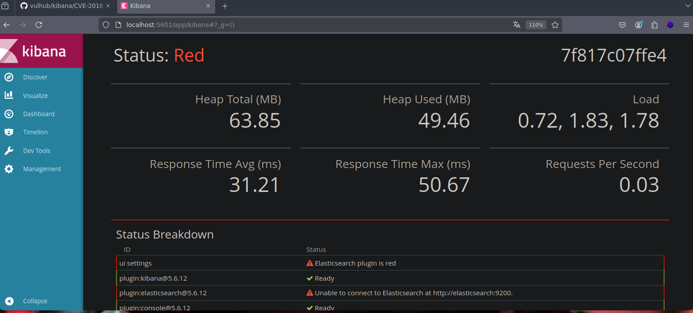
---

## Reverse Shell con Node.js

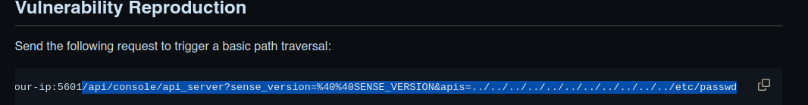

---

Aunque el repositorio menciona *ingeniería inversa*, en este caso se implementa una **reverse shell en Node.js**.

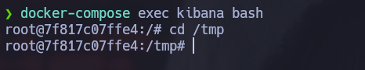

---

Pero la máquina tiene instalado **nano** y al hacer un **apt-update** tampoco nos funciona, la solución es ejecutar lo siguiente con **echo**: 
```bash
echo "deb http://archive.debian.org/debian/ jessie contrib main non-free" > /etc/apt/sources.list
```
Ahora cuando ya hemos actualizado, ya podemos instalar nano:

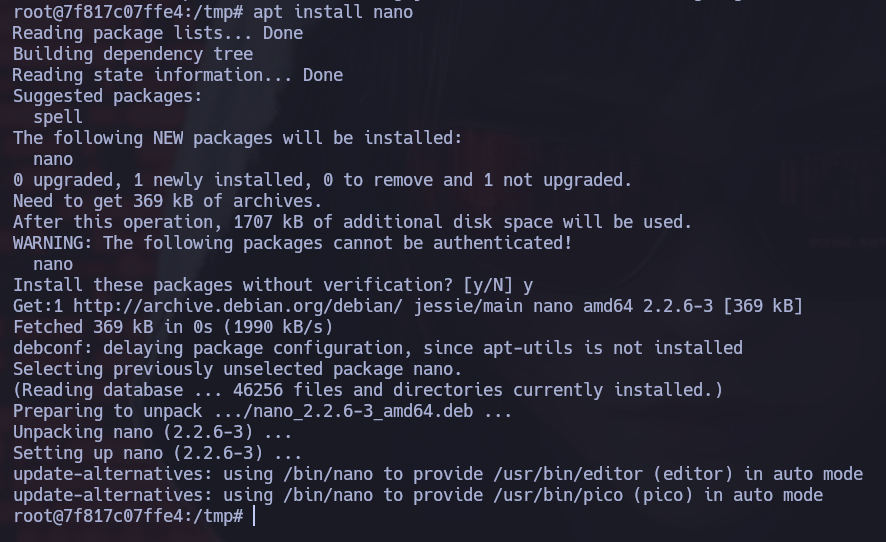

---

Ahora si nos creamos el archivo **reverse.js** con nano y buscamos en github: **NodeJs reverse shell**
y nos dan un ejemplo:

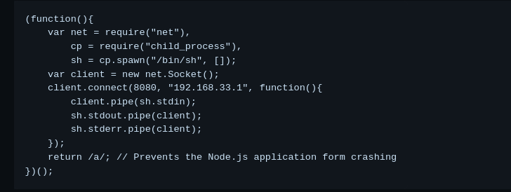

---

Este script se conecta al host atacante a través de un socket (puerto 443), redirigiendo entrada/salida del shell (`/bin/sh`) para permitir control remoto: 

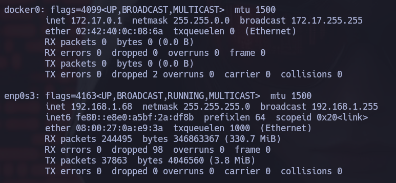

---

Entonces el script quedaría así:

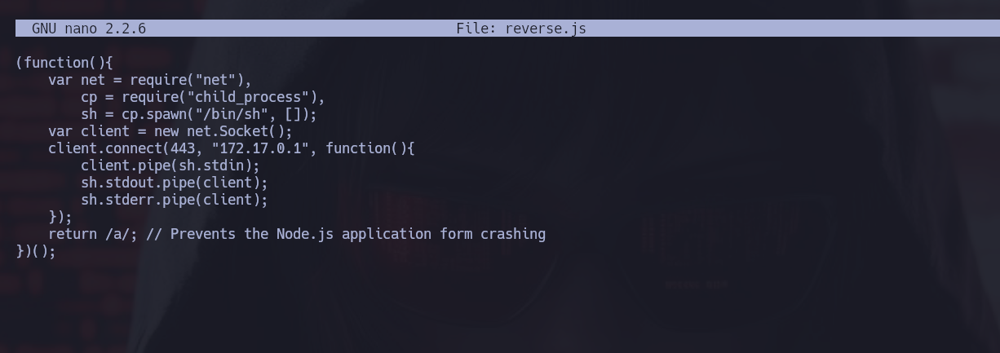

---

## Explotación de Vulnerabilidad

Ahora utilizaremos un  Path Traversal:

Es una vulnerabilidad en la que el atacante manipula las rutas de archivos en una aplicación web para acceder a archivos del sistema que no deberían estar disponibles.

Se usa ../ repetidamente para subir directorios hasta llegar a la raíz /.

Luego, se especifica un archivo como /etc/passwd.

Como ya tenemos el ejemplo que nos han dado en git de un path traversal en vulhub.

Sólo haremos un pequeño cambio al final de la ruta pondremos el archivo que nos hemos creado con **JS** así:

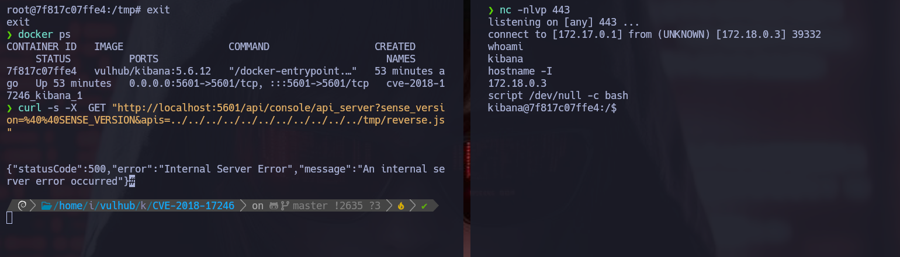

---

Se utiliza `netcat` para escuchar, y se entrega el payload mediante Path Traversal.

Máquina resuelta y comprometida exitosamente:)

🛡️ **Nota**: Esta práctica se realizó en un entorno controlado y con fines educativos. Nunca explotes vulnerabilidades sin autorización explícita.

📅 Resuelta el 02/06/25

👩 Por Marcela Jiménez (aka Mar) 🐉
